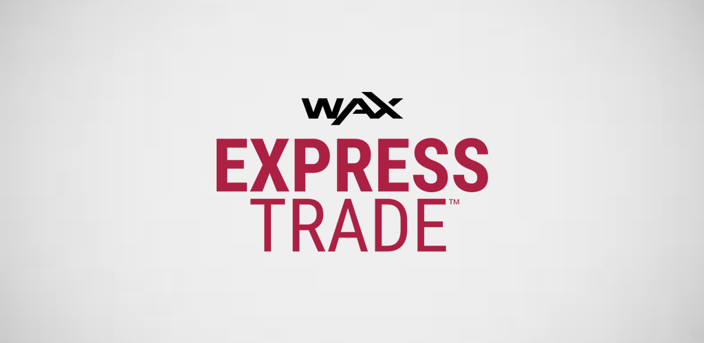

	

	Available on Google Play: https://play.google.com/store/apps/details?id=com.opskins.trade.waxexpresstrade

## Setup

### Request an API Key

* [Existing OPSkins user](https://github.com/Kevin-Reinke/WAX_ExpressTrade_Integration#request-an-api-key)
* [New OPSkins user](https://github.com/Kevin-Reinke/WAX_ExpressTrade_Integration#set-up-an-opskins-account)

## Configuration

Client details: *app/src/main/res/values/keys.xml*

## Key Features

### Trade with a specific user (redirect)

*https://trade.opskins.com/t/{USER_ID}/{TOKEN}*

### View a specific trade offer (redirect)

*https://trade.opskins.com/trade-offers/{OFFER_ID}*

### Automatically accepts case-opening trade offers

(Only when the app is open/minimized to avoid user conflicts - e.g. site development)